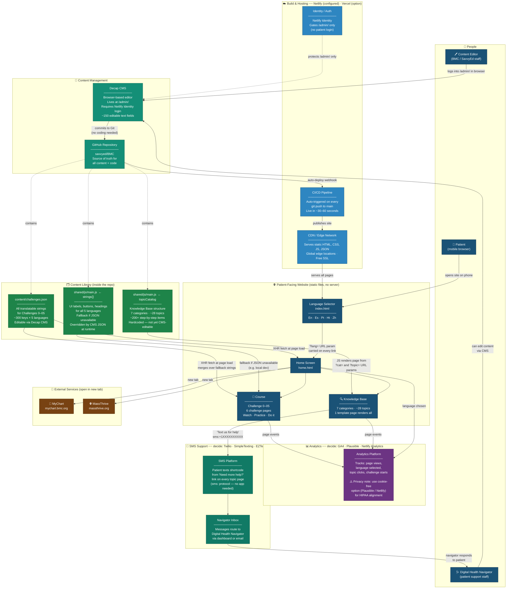
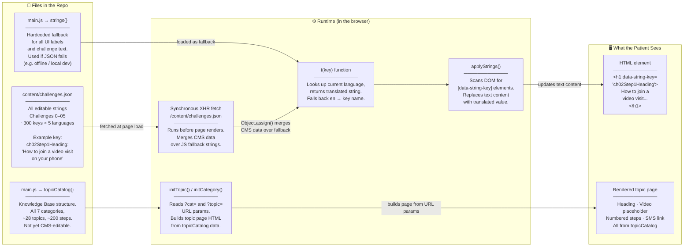

# BMC Digital Health Navigator — System Architecture

> **How to use this file:**
> - View on GitHub — Mermaid diagrams render automatically
> - Edit online at [mermaid.live](https://mermaid.live) — paste the code block below
> - Import into Notion, Confluence, or VS Code (with Mermaid extension)
> - To swap in a specific tool, find the placeholder label and update the text

---

## Diagram 1 — Full System Overview

---

## Diagram 2 — Content Library Detail
*How content gets from the file into the patient's browser*

---

## How Each Layer Works

### 📝 Content Management (Decap CMS + GitHub)
Editors log into `/admin/` in any browser — no coding or Git knowledge needed. Decap CMS saves changes directly to GitHub as commits. GitHub is the single source of truth for all content and code. Decap CMS on Netlify is already configured in this repo.

### 🗂️ Content Library — Two types of content

| Content | Where it lives | Who edits it | How it loads |
|---|---|---|---|
| **Challenge text** — titles, headings, step instructions, checklists, character names | `content/challenges.json` | Anyone via Decap CMS | Fetched by XHR at page load, merged over fallback |
| **Knowledge Base** — 7 categories, ~28 topics, ~200 steps | `main.js → topicCatalog{}` | Developer only (for now) | JS reads URL params (`?cat=`, `?topic=`) and builds the page |
| **UI labels & buttons** | `main.js → strings{}` | Developer, or CMS (overrides) | Hardcoded in JS; CMS JSON replaces at runtime |

> **Phase 2 note:** The Knowledge Base (`topicCatalog`) is currently hardcoded in JavaScript. Moving it into editable JSON (like the challenges) is the natural next step once content is finalized.

### ⚙️ How Content Gets on Screen
1. Patient loads a page (e.g. `course/challenge-02.html?lang=es`)
2. `main.js` runs a **synchronous fetch** of `content/challenges.json`
3. CMS-edited strings are **merged** over the JS fallback strings
4. `applyStrings()` scans the DOM for every `data-string-key` attribute and swaps in the right translation
5. All links with `data-lang-href` get `?lang=es` appended automatically
6. For Knowledge Base pages: `initTopic()` reads `?cat=` and `?topic=` from the URL and **builds the entire page** from the `topicCatalog` object

### ☁️ Build & Hosting (Netlify — already configured)
Every git push to `main` auto-deploys. Site URL is `tiny-hamster-9bcc46.netlify.app`. Netlify Identity gates the `/admin/` CMS route — no patient login needed or used.

### 🌐 Patient-Facing Site
Pure HTML/CSS/JS. No login, no app install, no cookies. Language selection is preserved via `?lang=` URL parameters on every link throughout the site.

### 📊 Analytics
Tracking script on each page captures anonymous usage — language chosen, pages viewed, challenges started, topics clicked. **Privacy recommendation:** Use a cookie-free tool (Plausible or Netlify Analytics) to avoid HIPAA complications.

### 💬 SMS Support
Each Knowledge Base topic page has a "Text us for help" link using the `sms:` protocol — it opens the patient's native SMS app with the navigator's number pre-filled. No backend is required on the site side.

---

*Last updated: April 2026 · Questions: Tianna Tagami, M.Ed.*
