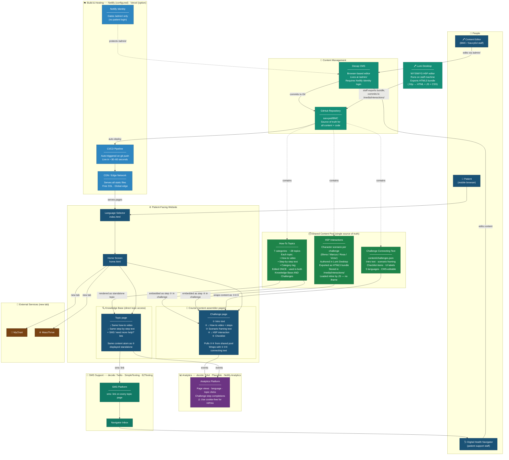
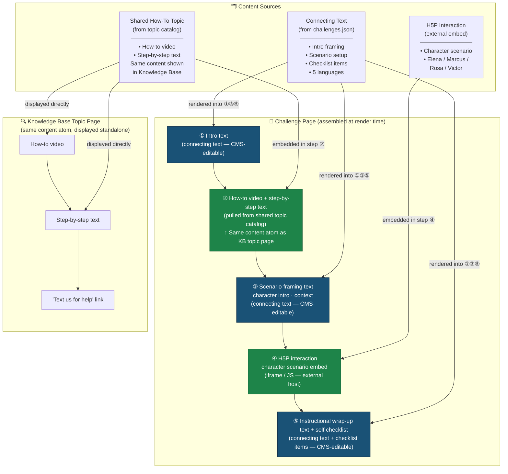
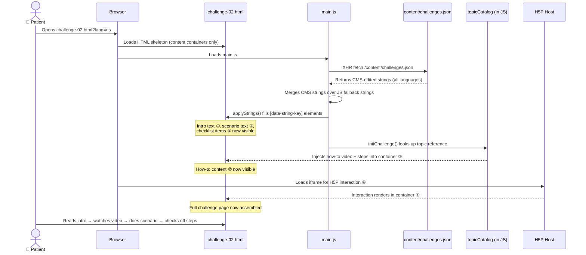

# BMC Digital Health Navigator — System Architecture

> **How to use this file:**
> - View on GitHub — Mermaid diagrams render automatically
> - Edit online at [mermaid.live](https://mermaid.live) — paste the code block below
> - Import into Notion, Confluence, or VS Code (with Mermaid extension)
> - To swap in a specific tool, find the placeholder label and update the text

---

## Diagram 1 — Full System Overview



---

## Diagram 2 — Challenge Page Assembly Model
*A challenge page is not a monolithic document — it's a series of content containers with connecting text woven between them*



**Legend:**
- 🟦 **Blue containers** — connecting text (unique to each challenge, CMS-editable, 5 languages)
- 🟩 **Green containers** — shared content atoms (live once, referenced by both Challenge and KB pages)

---

## Diagram 3 — Content Flow at Runtime
*How the browser assembles a challenge page from multiple sources*



---

## How the Content Model Works

### The Core Principle: Write Once, Appear Twice
A how-to video and its accompanying step-by-step text live in **one place** — the shared topic catalog. That same content atom appears in two contexts:
- **Knowledge Base:** displayed on its own topic page, with an SMS help link below it
- **Challenge:** embedded as step ② inside a challenge page, with connecting text around it

An editor updates the video or steps once, and the change appears in both places automatically.

### Three Content Types

| Type | What it is | Edited by | Exists in 5 languages? |
|---|---|---|---|
| **How-to topics** | Video + numbered steps for a specific task | Content editor via CMS | Yes (target) |
| **H5P interactions** | Character scenario — interactive practice activity | Course designer in **Lumi Desktop** (exports HTML5) | Yes (H5P handles internally) |
| **Connecting text** | Intro framing, scenario setup, checklist items | Content editor via CMS | Yes |

### What a Challenge Page Actually Contains
A challenge is a **sequence of containers**, not a wall of content:

```
┌─────────────────────────────────────┐
│ ① Intro text           [connecting] │
├─────────────────────────────────────┤
│ ② How-to video                      │
│    Step-by-step text   [shared atom]│
├─────────────────────────────────────┤
│ ③ Scenario framing     [connecting] │
├─────────────────────────────────────┤
│ ④ H5P interaction      [embedded]   │
├─────────────────────────────────────┤
│ ⑤ Wrap-up text                      │
│    Self checklist      [connecting] │
└─────────────────────────────────────┘
```

### How H5P Interactions Are Authored and Delivered

H5P interactions are built in **[Lumi Desktop](https://lumi.education/)** — a free WYSIWYG editor that runs on a staff machine (no account needed). The workflow:

1. Course designer opens Lumi, builds the character scenario interaction
2. Lumi exports a self-contained **HTML5 bundle** (folder with `index.html`, JS, CSS, and content data)
3. Staff commits that folder to `/media/interactions/ch0X-scenario/` in the GitHub repo
4. On the challenge page, a JS function (`loadInteraction()`) **fetches the bundle's HTML and injects it inline** into the `#interaction-XX` container — no iframe needed
5. Netlify deploys, and the interaction is live

> **Why no iframe?** Iframes create focus-management and accessibility issues on mobile, and can cause scroll-jail on older Android browsers — both problems for this patient population. Loading the bundle inline avoids both.

> **Lumi note:** Lumi saves `.lumi` project files (keep these in a separate `/lumi-source/` folder in the repo so interactions can be re-edited later). Only the exported HTML5 folder needs to go in `/media/interactions/`.

### Current State vs. Target State

| | Current prototype | Target |
|---|---|---|
| How-to topics | Hardcoded in `main.js → topicCatalog{}` | JSON file, CMS-editable |
| Challenge content | `content/challenges.json` (connecting text only) | Same + topic references |
| Challenge pages pull from topic catalog? | No — content is duplicated | Yes — one source, two surfaces |
| H5P interactions | Placeholder `<div>` | Live H5P embed via iframe |
| Languages | 5 (en full, others partial) | 5 (all complete) |

> **Next step:** Convert `topicCatalog` from hardcoded JS into a JSON file managed by the CMS. Each challenge page config would then include a list of topic references (e.g. `"topicRefs": ["join-video-phone", "setup-camera"]`) that tell the page assembler which how-to atoms to pull in.

---

*Last updated: April 2026 · Questions: Tianna Tagami, M.Ed.*
