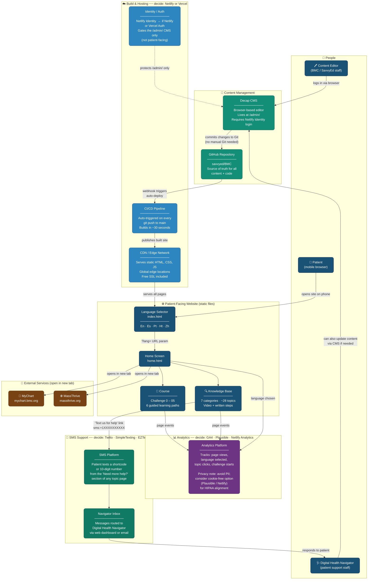

# BMC Digital Health Navigator — System Architecture

> **How to use this file:**
> - View on GitHub — Mermaid diagrams render automatically
> - Edit online at [mermaid.live](https://mermaid.live) — paste the code block below
> - Import into Notion, Confluence, or VS Code (with Mermaid extension)
> - To swap in a specific tool, find the placeholder label and update the text

---

---

## How Each Layer Works

### 📝 Content Management (Decap CMS + GitHub)
Editors log into `/admin/` in their browser — no coding required. Decap CMS writes changes directly to GitHub as git commits. GitHub is the single source of truth for all text, pages, and media. No database, no server-side CMS.

### ☁️ Build & Hosting (Netlify or Vercel)
Every git push to `main` automatically triggers a rebuild and redeploy — usually live within 30–60 seconds. The site is served as static files from a global CDN, which means fast load times on mobile and no server to maintain. Netlify Identity (or equivalent) gates the `/admin/` route so only staff can edit content.

### 🌐 Patient-Facing Site
Pure HTML/CSS/JS. No login for patients. Language is passed as a URL parameter (`?lang=es`). The site works on any smartphone browser with no app install required.

### 📊 Analytics
A small script on each page tracks anonymous usage: which language is chosen, which topics are viewed, which challenges are started. **Privacy recommendation:** use a cookie-free tool (Plausible or Netlify Analytics) to avoid HIPAA complications with PII in analytics logs.

### 💬 SMS Support
Each Knowledge Base topic has a "Text us for help" link (`sms:` protocol) that opens the patient's native SMS app with the navigator's number pre-filled. The navigator receives and responds via an SMS platform dashboard. No backend needed on the site side.

---

*Last updated: April 2026 · Questions: Tianna Tagami, M.Ed.*
